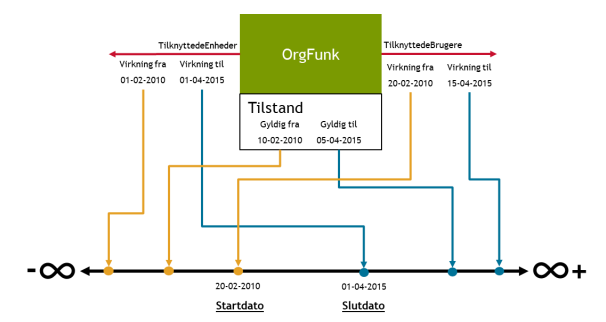
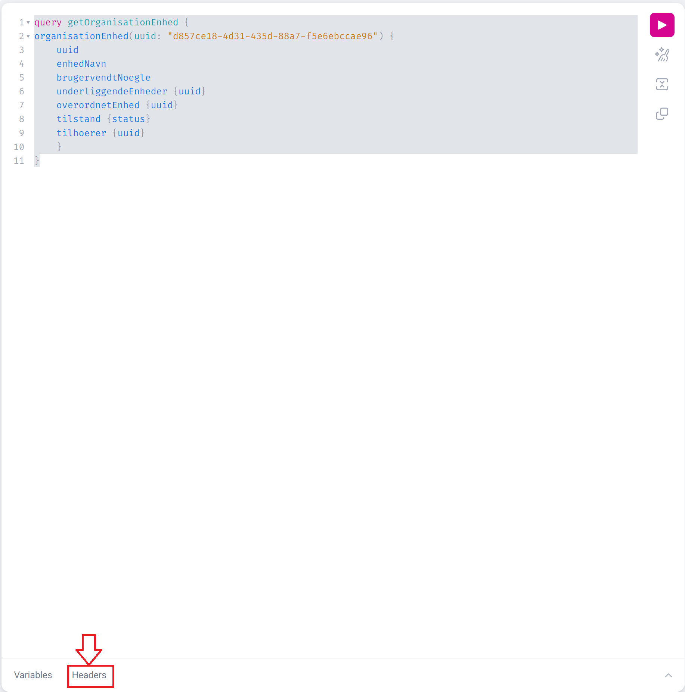
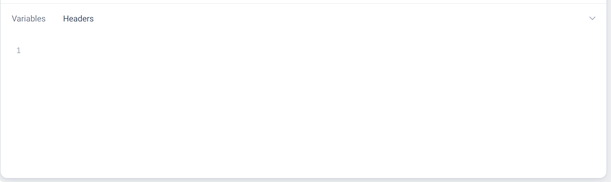
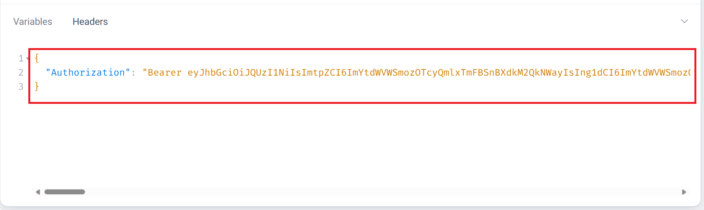
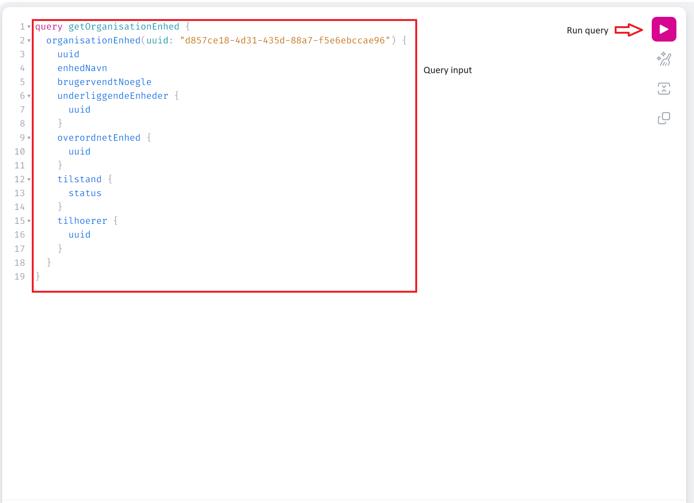

# Organisation GraphQL Service (OrganisationHent)

## Overview
The Organisation GraphQL Service is designed to provide an efficient and flexible means of retrieving data for your business applications. It allows you to specify which fields from which objects you want in a single request, simplifying your data retrieval process.

The current snapshot of data available in "Fælleskommunalt Organisationssystem" can queried - and the ambition is to support integrators in getting the relevant data easy - using modern and mature technology. 

## Getting Started
To start using our Organisation GraphQL Service make an authenticated GraphQL request to `https://organisation.stoettesystemerne.dk/organisation/organisationhent/1` and start retrieving data.

You can also use our [live sandbox](#organisation-graphql-sandbox) to familiarize yourself with the application and the schema.

### Required request headers
In order for your request to be executed correctly, it will have to contain the following headers:
- `Authorization`, which should contain the bearer JWT token (see for instance [Getting JWT token in Postman](#Getting-JWT-token-in-Postman) for details on how to obtain the token,
- `x-TransaktionsId`, which should be an UUID,
- `x-TransaktionsTid`, which should be an ISO-compliant datetime,

The resulting headers should look like this:

    {
        "Authorization": "Bearer ${token}",
        "x-TransaktionsId": "2a52f347-5157-4381-be91-3df394017b8d",
        "x-TransaktionsTid": "2023-10-10T17:10:11.3441152+02:00[Europe/Berlin]"
    }


## Organisation GraphQL Schema 
You can see the current Organisation GraphQL schema on [Kombit's Github repository](https://github.com/kombit/org-graphql/tree/main/api/gql). You can also explore the schema on the [live sandbox](#organisation-graphql-sandbox).

### Query types

The Organisation-GQL application currently supports the following query types:
- Organisation
Used to query for an individual organisation by CVR, optionally fetching data for active subordinate units. 
- OrganisationEnhed
Queries for details of individual organisation units by UUID, optionally fetching data for active subordinate units. 
- OrganisationEnhedListe
Used to query for all active or inactive Organisation Units belonging to a given CVR. There's also optional argument opgaver - containing rolle uuid and collection of KLE numbers. 
- Bruger
Used to query for an individual or list of Brugers by UUIDs. 

Note also that all GraphQL queries support drilling down to get details of the returned objects.


### Sample Queries

You can kick-start your queries by using the following sample queries:
#### Query `organisation`:
The query below demonstrates Korsbæk municipality can query data on Myndighed, Virksomhed and the two first level in the administrative organization.  
```
query organisation {
  organisation(cvr: "11111111") {
    uuid
    virksomhed {
      uuid
      cvrNummerTekst
    }
    myndighed {
      uuid
    }
    organisationEnhed {
      uuid
      underliggendeEnheder {
        uuid
      }
    }
  }
}
```
#### Query `organisationEnhed`:
The query demonstrates that it's possible to use a specific organisation unit as a starting point for getting data - and drill down and up in the organisation hierarki.     
```       
query getOrganisationEnhed {
  organisationEnhed(uuid: "5dbc66a1-94ab-4097-aacc-3931adb52b34") {
    uuid
    enhedsnavn
    brugervendtNoegle
    underliggendeEnheder {
      uuid
    }
    overordnetEnhed {
      uuid
    }
    tilstand {
      status
    }
    tilhoerer {
      uuid
    }
    adresser {
      uuid
    }
  }
}
```
##### Query `organisationEnhed` with the `adresser` section:
The `adresser` section can be filtered using the `rolle` UUID argument. Each adresser section can be filtered independently. The `rolle` argument can be provided as a single UUID or an array of UUIDs. Avaiable roles are maintained in the FK Klassifikation system. If the `rolle` argument is not used, then all roles will be presented in the response. 
The query below illustrates a scenario in which a user requests:

- All addresses of the `organisationEnhed`.
- Addresses of the type `Postadresse ("80b610c6-314b-485a-a014-a9a1d7070bc4")` for the `overordnetEnhed`.
- Addresses of the types `Postadresse ("80b610c6-314b-485a-a014-a9a1d7070bc4")` and `Mobiltelefon ("8dcfa714-5ed3-4000-b551-2ba520e7d8ad")` for the `underliggendeEnheder`.


```
query OrganisationEnhed {
  organisationEnhed(uuid: "5dbc66a1-94ab-4097-aacc-3931adb52b34") {
    adresser {
      uuid
    }
    overordnetEnhed {
      adresser(rolle: "80b610c6-314b-485a-a014-a9a1d7070bc4") {
        uuid
        adresseRolleTitel
        adresseTekst
      }
    }
    underliggendeEnheder {
      adresser(
        rolle: [
          "80b610c6-314b-485a-a014-a9a1d7070bc4"
          "8dcfa714-5ed3-4000-b551-2ba520e7d8ad"
        ]
      ) {
        uuid
      }
    }
  }
}
```

####  Query `organisationEnhedListe`:
This description covers the pagination mechanism based on the following `organisationEnhedListe` query:

```
query getOrganisationEnhedListe {
  organisationEnhedListe(
    cvr: "11111111"
    status: AKTIV
    first: 500
    after: "ZDk4NDhiMTktZjUyYS00Y2ZmLWE1NTItMzE1MzI0MWQ3NWNh"
  ) {
    pageInfo {
      hasNextPage
      hasPreviousPage
      startCursor
      endCursor
    }
    edges {
      cursor
      node {
        uuid
        enhedsnavn
        brugervendtNoegle
        tilstand {
          status
          fraTidspunkt
          tilTidspunkt
        }
      }
    }
  }
}
```
We can use a query without pagination parameters, as shown in the example below, and by default, the system will retrieve results starting from the first element up to a maximum of 500 objects.

```
query getOrganisationEnhedListe {
  organisationEnhedListe(cvr: "11111111", status: AKTIV) {
    edges {
      cursor
      node {
        uuid
        enhedsnavn
        brugervendtNoegle
        tilstand {
          status
          fraTidspunkt
          tilTidspunkt
        }
      }
    }
  }
}
```

##### Pagination Parameters
The following parameters are used to control pagination:
- first: Specifies the maximum number of elements to return. The default value is **500**.
- after: Specifies the cursor for the next page of results. This value should be obtained from `pageInfo.endCursor` in the previous response.
- last: Specifies the maximum number of elements to return in the reverse order, starting from the end. The default value is **500**.
- before: Specifies the cursor for the previous page of results. This value should be obtained from `pageInfo.startCursor` in the previous response.

##### Pagination Information
The following pagination information is available in the response:
- pageInfo: An object containing the following fields:
	- hasNextPage: A boolean value indicating whether there are more pages of results.
	- hasPreviousPage: A boolean value indicating whether there is a previous page of results.
	- startCursor: The cursor for the first page of results.
	- endCursor: The cursor for the next page of results.
- edges: A list of elements on the current page. Each element contains the following fields:
	- cursor: The cursor for the current element.
	- node: The current element.

##### Example Usage
The following example demonstrates how to use the pagination mechanism:

1. Execute the query with the `first` parameter set to the desired number of elements.
2. If `pageInfo.hasNextPage` is `true`, execute the query again with the after parameter set to `pageInfo.endCursor`.
3. Repeat step 2 until there are no more pages of results.

**Note:** The usage of `last` and `before` parameters would be similar, but they would navigate the results in the opposite direction (retrieving elements from the end or the beginning, respectively).

##### Notes
- The pagination mechanism is based on cursors, which are unique identifiers for elements.
- Cursors can change over time, so it's important to store them and use them in subsequent queries.
- The maximum number of elements that can be returned in a single call is 500. 
- It is possible to request a specific number of elements, but it is not guaranteed that the server will return the exact number.
- Using pagination, you can't mix parameters 'first' with 'last' and 'after' with 'before'.

##### Additional Resources
- [GraphQL Cursor Connections Specification: ](https://relay.dev/graphql/connections.htm/) The pagination mechanism was constructed based on the resources described in the specification.
- [GraphQL Pagination: ](https://graphql.org/learn/pagination/) A link to the pagination description for GraphQL.

#####Query `organisationEnhedListe` with the `opgaver` parameter:
The following query will search for active organizational units in Korsbæk Kommune with tasks (opgaver) associated with the `role UUID '2a5f38d8-7092-4b3f-85cc-7e272c3c4bb0'` (Ansvarlig) and KLE numbers starting with `'00.01*'`, **or** having exactly `'02.05.02'`. The `kleNummer` field in the `opgaver` parameter is a collection, allowing for multiple elements.
         		
```
query OrganisationEnheList {
  organisationEnhedListe(
    cvr: "11111111"
    status: AKTIV
    opgaver: {
      rolle: "2a5f38d8-7092-4b3f-85cc-7e272c3c4bb0"
      kleNummer: ["00.01*", "02.05.02"]
    }
    first: 500
  ) {
    pageInfo {
      hasNextPage
      hasPreviousPage
      startCursor
      endCursor
    }
    edges {
      cursor
      node {
        uuid
        enhedsnavn
        tilstand {
          status
          fraTidspunkt
          tilTidspunkt
        }
        opgaver {
          kleEmneTitel
          kleEmneNummer
          opgaveRolleTitel
          klassifikation {
            rolle
            type
            indeks
          }
        }
      }
    }
  }
}
```
##### If you want to search for any KLE number, the notation `"*"` can be used:
```
query OrganisationEnheList {
  organisationEnhedListe(
    cvr: "11111111"
    status: AKTIV
    opgaver: { rolle: "2a5f38d8-7092-4b3f-85cc-7e272c3c4bb0", kleNummer: ["*"] }
    first: 500
  ) {
    pageInfo {
      hasNextPage
      hasPreviousPage
      startCursor
      endCursor
    }
    edges {
      cursor
      node {
        uuid
        enhedsnavn
        tilstand {
          status
          fraTidspunkt
          tilTidspunkt
        }
        opgaver {
          kleEmneTitel
          kleEmneNummer
          opgaveRolleTitel
          klassifikation {
            rolle
          }
        }
      }
    }
  }
}
```
#####Query `organisationEnhedListe` with the `itSystemer` parameter:
You can query for Organisation Units that have IT Systems with given UUIDs linked to them. 

To do that, pass the optional `itSystemer` parameter to the `organisationEnhedListe` query. The parameter takes a list of UUIDs. The response will contain all Organisation Units that have at least one of the IT Systems linked to them.
```
query OrganisationEnheList {
  organisationEnhedListe(
    cvr: "64942212"
    status: AKTIV
    itSystemer: [
      "52474ef2-d3b7-4e53-ba05-f25dbe0e1703"
      "61ad62e1-7ea0-42ae-a702-43779ebe8b06"
    ]
    first: 500
  ) {
    pageInfo {
      hasNextPage
      hasPreviousPage
      startCursor
      endCursor
    }
    edges {
      cursor
      node {
        uuid
        enhedsnavn
        brugervendtNoegle
        itSystemer {
          uuid
          itSystemNavn
        }
      }
    }
  }
}
```

#### Query `bruger`:
```   
query Bruger {
  bruger(
    uuid: [
      "9c86eff9-de9f-4f0c-9d67-60b4aeecb3ef"
      "0f86bf7f-092f-446f-8d93-313e342738e1"
    ]
  ) {
    uuid
    brugernavn
    brugervendtNoegle
    tilstand {
      status
    }
  }
}
```
#####Query `bruger` with the `person` section:
A `person` is an extension of the business object `bruger` (User). A person never exists without a linked user item. A `person` represents an individual and is employed to register employees or other individuals with a link to the municipality. It is exclusively used for registering a `navn` (name) and possibly a `CPR` number.

By default, a person's `navn` and `CPR` number are not included in the output. If you wish to provide the user access to this personal data, you can implement two data restrictions:
- SeNavn
- SeCPR-nummer

If the user's token includes these data restrictions with the value 'Ja', the name and CPR number are then returned in the output for the person, otherwise the response will include a warning, and data fields will be null. Errors and Warnings are described in the [Error handling section ](#Error-handling).

The following query illustrates a scenario in which a user requests person data:
```
query Bruger {
  bruger(uuid: "9c86eff9-de9f-4f0c-9d67-60b4aeecb3ef") {
    uuid
    brugernavn
    person {
      navn
      cpr
    }
  }
}

```
#####Query `bruger` with the `adresser` section:
The `adresser` section can be filtered using the `rolle` UUID argument. The `rolle` argument can be provided as a single UUID or an array of UUIDs. Avaiable roles are maintained in the FK Klassifikation system. If the `rolle` argument is not used, then all roles will be presented in the response.

The query below illustrates a scenario in which a user requests:
- Addresses of the types `Lokation ("ad04ac80-e24a-45a5-9dd9-8537a916ac74")` and `E-mail ("5d13e891-162a-456b-abf2-fd9b864df96d")` for the `bruger`.
```
query Bruger {
  bruger(uuid: "f06b6721-e122-4d5a-bc92-e60ba66545e4") {
    uuid
    brugernavn

    adresser(
      rolle: [
        "ad04ac80-e24a-45a5-9dd9-8537a916ac74"
        "5d13e891-162a-456b-abf2-fd9b864df96d"
      ]
    ) {
      uuid
      adresseRolleTitel
      adresseTekst
    }
  }
}
```
##### Query `bruger` or `organisationEnhed` with the `harMedlemsskab/medlemskaber` section:
The `harMedlemsskab/medlemskaber` section of the query can be used to retrieve information about where the user is employed.

It can be filtered using the `rolle` UUID argument. The `rolle` argument can be provided as a single UUID or an array of UUIDs. Avaiable roles are maintained in the FK Klassifikation system. If the `rolle` argument is not used, then all roles will be presented in the response. 

The query below illustrates a scenario in which a user requests `harMedlemsskab` on the Bruger where the user works with the `rolle Enhedsrolle (Arbejder i) ("02e61900-33e0-407f-a2a7-22f70221f003")` :
```
query Bruger {
  bruger(uuid: ["f06b6721-e122-4d5a-bc92-e60ba66545e4"]) {
    uuid
    brugernavn
    brugervendtNoegle
    brugerTypeUuid
    brugerTypeTitel
    adresser(
      rolle: [
        "ad04ac80-e24a-45a5-9dd9-8537a916ac74"
        "5d13e891-162a-456b-abf2-fd9b864df96d"
      ]
    ) {
      uuid
      adresseRolleTitel
      adresseTekst
    }
    person {
      uuid
      navn
      brugervendtNoegle
      cpr
    }
    harMedlemskab(rolle: "02e61900-33e0-407f-a2a7-22f70221f003") {
      uuid
      medlemskabRolleTitel
      brugervendtNoegle
      funktionsTypeUuid
      funktionsTypeTitel
      start
      slut
      medlemAf {
        uuid
        enhedsnavn
        adresser {
          uuid
          adresseRolleTitel
          adresseTekst
        }
      }
    }
    tilstand {
      status
    }
  }
}

```
The next query illustrates a scenario in which a user is performing a query to request `medlemskaber` on the `OrganisationEnhed` where the employee works with the role "`Enhedsrolle (Arbejder i)`" ("02e61900-33e0-407f-a2a7-22f70221f003").
```
query OrganisationEnhed {
  organisationEnhed(uuid: "f06b6721-e122-4d5a-bc92-e60ba66545e4") {
    uuid
    enhedsnavn
    brugervendtNoegle
    tilstand {
      status
      fraTidspunkt
      tilTidspunkt
    }
    medlemskaber(rolle: "02e61900-33e0-407f-a2a7-22f70221f003") {
      uuid
      medlemskabRolleTitel
      brugervendtNoegle
      funktionsTypeUuid
      funktionsTypeTitel
      start
      slut
      bruger {
        uuid
        brugernavn
        brugerTypeTitel
        person {
          uuid
          navn
          brugervendtNoegle
          cpr
        }
      }
    }
  }
}

```

Membership fields `start` and `slut` are calculated based on the documentation available at [digitaliseringskataloget.dk](https://digitaliseringskataloget.dk/files/integration-files/110520231436/Anvisninger%20-%20SF1500%20-%203.0.pdf).



The calculation of the start date for organizational affiliation is performed by taking the latest (max) date among the following three possible dates: `orgFunk.Tilstand.VirkningFra`, `orgFunk.TilknyttedeBrugere.VirkningFra`, `orgFunk.TilknyttedeEnheder.VirkningFra`.

Similarly, the calculation of the possible end date for organizational affiliation is done by taking the earliest (min) date among the following three possible dates: `orgFunk.Tilstand.VirkningTil`, `orgFunk.TilknyttedeBrugere.VirkningTil`, `orgFunk.TilknyttedeEnheder.VirkningTil`.

## Error handling

The Organisation-GraphQL application can return two types of errors.

### Errors encountered before query execution
For errors encountered before query execution, the response will have the following format:

     {
        "timestamp": <ISO-compliant timestamp of the error>
        "status": <HTTP status returned from the server>,
        "error": <error classification, see below>,
        "message": <detailed user-friendly description of the error>,
        "path": <path to which the request was made>
    }

You can expect this type of error response for unauthorized requests, requests without required headers, or when the service is down for maintenance (see [Error classifications](#error-and-warning-classifications) below for details).

| Value | HTTP Status Code | Description |
|-|-|-|
|`BadRequest`|`400`|Returned when one of the additional header fields - `x-TransaktionsId` or `x-TransaktionsTid` are missing or invalid.|
|`Unauthorized`| `401`| Returned when the request contains no JWT token, the token is invalid.|
|`Internal ServerError`|`500`|Other cases where the system responds with an error.|
|`Service Unavailable`|`503`|Returned when the application / requested data subset is temporarily out of service due to ongoing data synchronisation.|


This type of errors will return with the HTTP status contained in the ERROR fields, and will not return `200OK`.

### Errors on queries that execute and return data with errors
If the query itself executes with errors, you can see the information about the errors in the `errors` part of the response, followed by any `data` it might have returned. 

    {
        "errors": [
            {
                "message": <detailed user-friendly description of the error>,
                "locations": [
                    {
                        "line": <line where the offending token was found>,
                        "column": <column where the offending token was found>
                    }
                ],
                "extensions": {
                    "message": <detailed user-friendly description of the error, repeated from "message" field above>,
                    "kildeId": <will always be "GrapqhQL Organisation", used for auditing/debugging purposes>,
                    "id": <UUID of the error, used for auditing/debugging purposes>,
                    "type": <"ERROR|WARNING", see below>,
                    "classification": <error classification, see below>
                }
            },
        ],
        "data": {
            <any data returned by the query>
        }
    }

This type of error will always return with HTTP status `200OK`.

### Error and Warning classifications
The Organisation-GraphQL application will return the following application-specific error classifications:
| Value | Description |
|-|-|
|`NotFound`|The object you were attempting to find could not be located (i.e., incorrect UUID in the organisationEnhed query) or, if you lack access to it, the object is outside the scope of your token's user context.|
|`ValidationError`|Returned when the supplied query is syntactically correct, but does not pass validation (i.e. due to CVR or UUID in wrong format).|
|`NullValueInNonNullableField`| Returned when a null value was found in the data for a field that is normally non-nullable.|
|`InvalidSyntax`|Returned when the query itself could not be parsed due to wrong syntax.|
|`Unauthorized`|  Returned when there is no proper data restriction in the JWT token, i.e. when attempting to read Person's sensitive data|
|`ServerError`|Other cases where the system responds with an error.|

### Error types:
| Value | Description |
| - | - | 
| `ERROR`| Returned when a query, or part of a query, could not be processed due to an error (e.g. invalid syntax, or object not found). The query may return partial data. |
| `WARNING` | Returned as an extra information to the user when it is needed by some data returned by query, e.g. when the data being queried is malformed in the source system. |


## Organisation GraphQL Sandbox
You can go to `https://organisation.eksterntest-stoettesystemerne.dk/organisation/graphiql/1/?path=/organisation/organisationhent/1` and play with sample data. To be able to do so, you must retrieve and add a JWT token.

### Getting JWT token

The GraphQL API requires a JWT token in the header of the request. The issuing of tokens is handled by Adgangsstyrring. The documentation is available at  
[digitaliseringskataloget](https://digitaliseringskataloget.dk/integration/sf1514)

### Example of how to get JWT Token in Postman

To request a JWT token in Postman, follow these steps:

1. **Add Your `.p12` Certificate File as a PFX File**:
    - Navigate to **Settings -> Certificates**.
    - Under the **Client Certificates** section, add the certificate for `n2adgangsstyring.eksterntest-stoettesystemerne.dk` domain.
    - For more detailed instructions, refer to [Postman documentation on certificates](https://learning.postman.com/docs/sending-requests/certificates/).

2. **Disable `TLS v1.3` in Request Settings**:
    - Ensure that `TLS v1.3` is disabled in the request settings:  
      

3. **Make a `POST` Request**:
    - URL: `https://n2adgangsstyring.eksterntest-stoettesystemerne.dk/runtime/api/rest/oauth/v1/issue`
    - Add the following keys as `x-www-form-urlencoded` in the Body:

| Key        | Value                                                                 |
|------------|-----------------------------------------------------------------------|
| client_id  | http://stoettesystemerne.dk/service/organisation/3                    |
| grant_type | client_credentials                                                    |
| scope      | entityid:http://stoettesystemerne.dk/service/organisation/3,anvenderkontekst:11111111 |

4. **Token for a Different CVR**:
    - If you need a token for a different CVR, change the `anvenderkontekst` value in the scope.


### Adding headers in GraphiQL 

When you open the GraphiQL window, you will see a button called "Headers":



Click it, and a text space will appear:


Input the token obtained in the previous step as

    {
        "Authorization": "Bearer ${token}"
    }
    


Then, add the `x-TransaktionsId` and `x-TransaktionsTid` headers, as described in [Required request headers](#Required-request-headers).

### Make GraphiQL requests
You can now write queries for the application in the GraphiQL interface. The interface provides a fair amount of schema-based autocomplete to help guide you through the process. 

See [`Sample Queries`](#sample-queries) section for some samples to get you started.



### Dynamic schema documentation in GraphiQL
To see the dynamic documentation, fill in the headers as discused in [`Adding headers in GraphiQL`](#adding-headers-in-graphiql), refresh the page and click the docs icon in the top-left corner of the GraphiQL window. This will open the schema explorer, where you can see the description of the current schema objects:


## Versioning of GraphQL Schema and endpoint

### Major versions of the schema
* In the best practices it is recommended to avoid versioning – but evolving the schema without breaking backwards compatibility. 
* We want to keep the option open – incase restructuring, renaming, or removing of data is required.
  * There will be one SDL pr. major version. Given the evolving nature of GraphQL, adding object types, fields, queries etc. will not trigger a new major version.
* Upcoming breaking changes in a following major version, eg. removing, renaming, restructuring of object types, fields, queries etc. can be hinted using the @deprecated annotation – and appropriate governance around decommission of old major versions can be introduced. 

### Minor versions of the schema 
* It is deemed not necessary to keep minor versions of the schema versioned on SDL and endpoint level. The evolvement of the schema can be tracked in Git. 
* There is a need to be able to communicate minor changes of the API. Each merge to the master branch can be considered a minor version – and the commit message(s) can be used as a basis for a release communication. 

### Versioning in the URI and format of endpoint

To support concurrent major versions of the API, we will adopt the URI versioning approach known from restful APIs. 

Example: 
```
Version 1(.x) will be available in the file: 
schemaOrganisationV1.gql
```

And the URI will for major version 1 be:
```
https://organisation.stottesysterne.dk/organisation/organisationhent/1
```

## Feedback and support
We value your feedback and are committed to providing exceptional support. If you have any questions or have suggestions for improvement, please don't hesitate to contact us at [FKI@kombit.dk]

If you encounter any issues, please don't hesitate to contact our support team at [SLA og åbningstider](https://digitaliseringskataloget.dk/sla-og-aabningstider).
