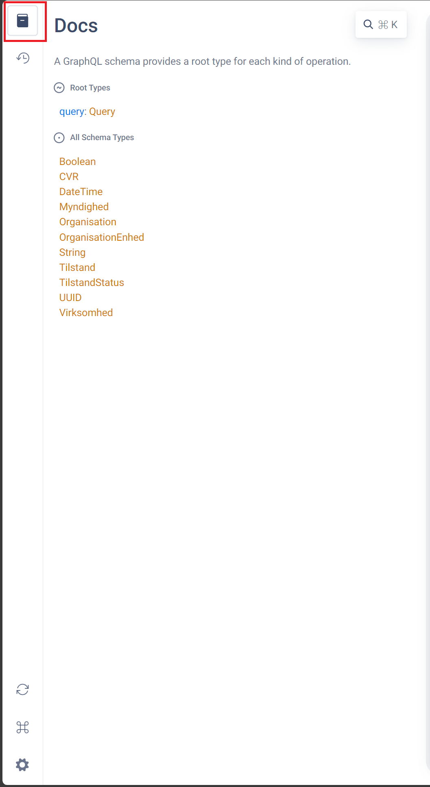

# Organisation GraphQL Service

## Overview
_KOMBIT_

## Key Features
_Kombit_

## Getting Started

To start using our Organisation GraphQL Service make an authenticated GraphQL request to `https://organisation.stoettesystemerne.dk/sts-organisation-graphql/graphql` and start retrieving data.

You can also use our [live sandbox](#organisation-graphql-sandbox) to familiarize yourself with the application and the schema.

### Required request headers
In order for your request to be executed correctly, it will have to contain the following headers:
- `Authorization`, which should contain the bearer JWT token (see for instance [Getting JWT token in Postman](#Getting-JWT-token-in-Postman) for details on how to obtain the token,
- `x-TransaktionsId`, which should be an UUID,
- `x-TransaktionsTid`, which should be an ISO-compliant datetime,

The resulting headers should look like this:

    {
        "Authorization": "Bearer ${token}",
        "x-TransaktionsId": "2a52f347-5157-4381-be91-3df394017b8d",
        "x-TransaktionsTid": "2023-10-10T17:10:11.3441152+02:00[Europe/Berlin]"
    }

## Organisation GraphQL Schema 
You can see the current Organisation GraphQL schema on [Kombit's Github repository](https://github.com/kombit/org-graphql/tree/main/api/gql). You can also explore the schema on the [live sandbox](#organisation-graphql-sandbox).

### Query types

The Organisation-GQL application currently supports the following query types:
- Organisation
Used to query for individual organisation by CVR, optionally fetching data for active subordinate units. 
- OrganisationEnhed
Queries for details of individual organisation units by UUID, optionally fetching data for active subordinate units. 
- OrganisationEnhedListe
Used to query for all active or inactive Organisation Units belonging to a given CVR. 

Note also that all GraphQL queries support drilling down to get details of the returned objects.

### Sample Queries

You can kick-start your queries by using the following sample queries:
1. Query `organisation`:

        query organisation {
            organisation(cvr: "11111111") {
                uuid,
                virksomhed {
                    uuid,
                    cvrNummerTekst
                },
                myndighed {
                    uuid
                },
                organisationEnhed {
                    uuid
                    underliggendeEnheder {
                        uuid
                    }
                }
            }
        }
2. Query `organisationEnhed`:

         query getOrganisationEnhed {
             organisationEnhed(uuid: "5dbc66a1-94ab-4097-aacc-3931adb52b34") {
                 uuid
                 enhedNavn
                 brugervendtNoegle
                 underliggendeEnheder {
                     uuid
                 }
                 overordnetEnhed {
                     uuid
                 }
                 tilstand {
                     status
                 }
                 tilhoerer {
                     uuid
                 }
             }
         }

3. Query `organisationEnhedListe`:

         query organisationEnhedList {
             organisationEnhedListe(cvr: "11111111", status: AKTIV) {
                 uuid
                 underliggendeEnheder {
                     uuid
                 }
                 brugervendtNoegle
                 overordnetEnhed {
                     uuid
                 }
                 tilstand {
                     status
                     fraTidspunkt
                 }
             }
         }

## Error handling

The Organisation-GraphQL application can return two types of errors.

### Errors encountered before query execution
For errors encountered before query execution, the response will have the following format:

     {
        "timestamp": <ISO-compliant timestamp of the error>
        "status": <HTTP status returned from the server>,
        "error": <error classification, see below>,
        "message": <detailed user-friendly description of the error>,
        "path": <path to which the request was made>
    }

You can expect this type of error response for unauthorized requests, requests without required headers, or when the service is down for maintenance (see [Error classifications](#error-classifications) below for details).

This type of errors will return with the HTTP status contained in the ERROR fields, and will not return `200OK`.

### Errors on queries that execute and return data with errors
If the query itself executes with errors, you can see the information about the errors in the `errors` part of the response, followed by any `data` it might have returned. 

    {
        "errors": [
            {
                "message": <detailed user-friendly description of the error>,
                "locations": [
                    {
                        "line": <line where the offending token was found>,
                        "column": <column where the offending token was found>
                    }
                ],
                "extensions": {
                    "message": <detailed user-friendly description of the error, repeated from "message" field above>,
                    "kildeId": <will always be "GrapqhQL Organisation", used for auditing/debugging purposes>,
                    "id": <UUID of the error, used for auditing/debugging purposes>,
                    "type": <"ERROR|WARNING", see below>,
                    "classification": <error classification, see below>
                }
            },
        ],
        "data": {
            <any data returned by the query>
        }
    }

This type of error will always return with HTTP status `200OK`.

### Error classifications

The Organisation-GraphQL application will return the following application-specific error classifications:
| Value | HTTP Status Code | Description |
|-|-|-|
|`NotFound`|`200`|The object you were trying to find could not be found (i.e. bad UUID in `organisationEnhed` query).|
|`ValidationError`|`200`|Returned when the supplied query is syntactically correct, but does not pass validation (i.e. due to CVR or UUID in wrong format).|
|`NullValueInNonNullableField`|`200`|Returned when a null value was found in the data for a field that is normally non-nullable.|
|`InvalidSyntax`|`200`|Returned when the query itself could not be parsed due to wrong syntax.|
|`BadRequest`|`400`|Returned when one of the additional header fields - `x-TransaktionsId` or `x-TransaktionsTid` are missing or invalid.|
|`Unauthorized`| `401`| Returned when the request contains no JWT token, the token is invalid or when you request data for organisations you do not have access to. |
|`ServerError`|`500`|Other cases where the system responds with an error.|
|`Service Unavailable`|`503`|Returned when the application / requested data subset is temporarily out of service due to ongoing data synchronisation.|

### Error types:
| Value | Description |
| - | - | 
| `ERROR`| Returned when a query, or part of a query, could not be processed due to an error (e.g. invalid syntax, or object not found). The query may return partial data. |
| `WARNING` | Returned as an extra information to the user when it is needed by some data returned by query, e.g. when the data being queried is malformed in the source system. |

## Organisation GraphQL Sandbox
You can go to `https://organisation.eksterntest-stoettesystemerne.dk/sts-organisation-graphql/graphiql` and play with sample data. To be able to do so, you must retrieve and add a JWT token.

### Getting JWT token
To get the JWT token, make a POST request to: `https://n2adgangsstyring.test-sts.kmdnet.dk/runtime/api/rest/oauth/v1/issue?client_id=http://stoettesystemerne.dk/service/organisation/3&grant_type=client_credentials&scope=entityid:http://stoettesystemerne.dk/service/organisation/3,anvenderkontekst:11111111` with your certificate. You will get the token in response, under `access_token`:

    {
        "access_token": "eyJhbGciOiJQUzI1NiIsImtpZCI6ImYtdWVWSmozOTcyQmlxTmFBSnBXdkM2QkNWayIsIng1dCI6ImYtdWVWSmozOTcyQmlxTmFBSnBXdkM2QkNWayIsInR5cCI6IkpXVCJ9.eyJjdnIiOiIxMTExMTExMSIsInNwZWNfdmVyIjoiMS4wIiwicHJpdiI6ImV5SndjbWwyYVd4bFoyVm5jbTkxY0hNaU9sdDdJbkJ5YVhacGJHVm5aU0k2SW1oMGRIQTZMeTl2Y21kaGJtbHpZWFJwYjI0dVpHVjJMV1F0YzNSekxtdHRaRzVsZEM1a2F5OXliMnhsY3k5elpYSjJhV05sYzNsemRHVnRjbTlzWlM5eVpXUnBaMlZ5THpFaUxDSnpZMjl3WlNJNkluVnlianBrYXpwbmIzWTZjMkZ0YkRwamRuSk9kVzFpWlhKSlpHVnVkR2xtYVdWeU9qRXhNVEV4TVRFeElpd2lZMjl1YzNSeVlXbHVkSE1pT2x0ZGZTeDdJbkJ5YVhacGJHVm5aU0k2SW1oMGRIQTZMeTl2Y21kaGJtbHpZWFJwYjI0dVpHVjJMV1F0YzNSekxtdHRaRzVsZEM1a2F5OXliMnhsY3k5elpYSjJhV05sYzNsemRHVnRjbTlzWlM5MVpITjBhV3d2TVNJc0luTmpiM0JsSWpvaWRYSnVPbVJyT21kdmRqcHpZVzFzT21OMmNrNTFiV0psY2tsa1pXNTBhV1pwWlhJNk1URXhNVEV4TVRFaUxDSmpiMjV6ZEhKaGFXNTBjeUk2VzExOVhYMD0iLCJqdGkiOiJkMTNlNDY0Yi0zYTBlLTQ5MTEtOGI0Ny05ODU4ODJkNjQ2ODgiLCJzdWIiOiJodHRwOi8vc3RvZXR0ZXN5c3RlbWVybmUuZGsvc2VydmljZS9vcmdhbmlzYXRpb24vMyIsImNuZiI6eyJ4NXQjUzI1NiI6IkdhUkpwaVdrallLbFVYTlRLTVpmQWRDRmJDeVZ3SzM3X1Z2QmdzMnJVX2sifSwibmJmIjoxNjk2NTA1NjE5LCJleHAiOjE2OTY1MzQ0MTksImlhdCI6MTY5NjUwNTYxOSwiaXNzIjoiaHR0cHM6Ly9zYW1sLm4yYWRnYW5nc3N0eXJpbmcudGVzdC1zdHMua21kbmV0LmRrL3J1bnRpbWUvIiwiYXVkIjoiaHR0cDovL3N0b2V0dGVzeXN0ZW1lcm5lLmRrL3NlcnZpY2Uvb3JnYW5pc2F0aW9uLzMifQ.LSDl5OJ6cY7Hh1mqoeVbEQoEXuT1r-Se6gTDJrTSZHSB2OGUWPwfm0TPFy-nt-XH_h__Xc8Sq-sNJ72xpwUil2RzTNZwkjzo-P7L_XzB6sc6s2-pIN9sid5rDCXK602GbQ8aY39QhPidZc_UGgmcO587I_9wBwprDJjFWWHV6GJm0r4I_u2zBNvYAkEEMmGSxBsK9_2xoWkWGfaNvG50vCm-kzHyey9rCXEsJT5DihdaYhPZUKuTwGnO9Z0DlDoiFd5LkqDSaoRzsxwog8Lov_7YovjbKUPyqTbz32DFkxkS6n5NMX8lXaPsPMfxqUIAVYG2GeuVLIFgXjB_fYWOz3oVwiI641O_BBFPzgJGEWNXF3wj8OC7vwsclCCOgzCbihLQ0i5-a3fHu60UuHjzQVnKv9af5s51ay-ifWEbV-VIrsnnWlw4vxfR_r39AwjE9sEZiT2x3pfPueyxun9Q_DKAFXy1wyy5Kgf_hdikMsAZpeFTCqtiiWOGcVToW_sZ",
        "token_type": "Holder-of-key",
        "expires_in": 28800
    }

### Getting JWT token in Postman
To make a request for token in Postman, do the following:
1. Add your `.p12` certificate file as a PFX file.
Go to Settings -> Certificates -> Add Certificate and add the certificate for `
n2adgangsstyring.test-sts.kmdnet.dk` domain, under the **Client Certificates** section:

2. In Request settings, make sure that `TLS v1.3` is disabled:

3. Make a `POST` request to `https://n2adgangsstyring.test-sts.kmdnet.dk/runtime/api/rest/oauth/v1/issue?client_id=http://stoettesystemerne.dk/service/organisation/3&grant_type=client_credentials&scope=entityid:http://stoettesystemerne.dk/service/organisation/3,anvenderkontekst:11111111`.

If you want a token for a different CVR, change the `anvenderkontekst` at the end of the request, i.e.:
`https://n2adgangsstyring.test-sts.kmdnet.dk/runtime/api/rest/oauth/v1/issue?client_id=http://stoettesystemerne.dk/service/organisation/3&grant_type=client_credentials&scope=entityid:http://stoettesystemerne.dk/service/organisation/3,anvenderkontekst:99999999`

### Adding headers in GraphiQL 

When you open the GraphiQL window, you will see a button called "Headers":

Click it, and a text space will appear:

Input the token obtained in the previous step as

    {
        "Authorization": "Bearer ${token}"
    }
    

Then, add the `x-TransaktionsId` and `x-TransaktionsTid` headers, as described in [Required request headers](#Required-request-headers).

### Make GraphiQL requests
You can now write queries for the application in the GraphiQL interface. The interface provides a fair amount of schema-based autocomplete to help guide you through the process. 

See [`Sample Queries`](#sample-queries) section for some samples to get you started.

### Dynamic schema documentation in GraphiQL
To see the dynamic documentation, fill in the headers as discused in [`Adding headers in GraphiQL`](#adding-headers-in-graphiql), refresh the page and click the docs icon in the top-left corner of the GraphiQL window. This will open the schema explorer, where you can see the description of the current schema objects:

## Feedback and Support

We value your feedback and are committed to providing exceptional support. If you have any questions, encounter issues, or have suggestions for improvement, please don't hesitate to contact our support team at [kdi@kombit.dk].

